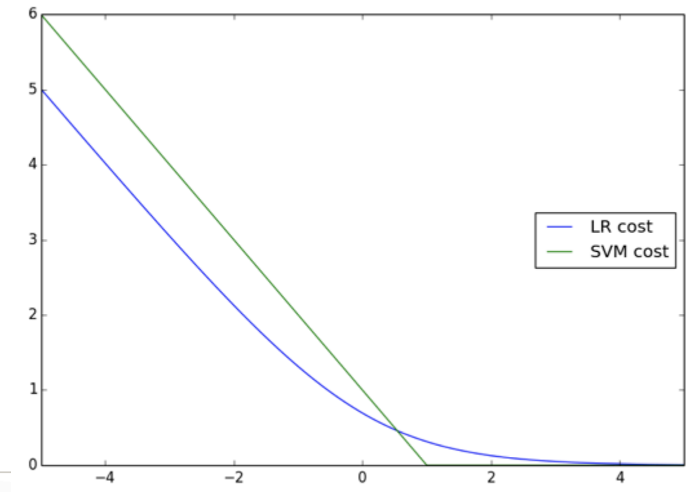

### Cost Function

__Alternative view of Logistic Regression__:

With the sigmoid function:
$$
h_\theta(x) = \frac{1}{1 + ^{-\theta^T x}}
$$
we need a very large positive value for $x$ to make a prediction close to 1. Conversely we want a very small negative numner to make prediction to 0.

Each training example's contribution to the cost function of logistic regression is:
$$
-y\log \frac{1}{1+e^{-\theta^T x}} - (1-y) \log (1- \frac{1}{1+e^{-\theta^T x}})
$$

If $y = 1$, we want the first term to reach zero, so we have $x >> 0$. If $y = 0$, we want the second term to approach zero, so we want $x << 0$.

From logistic regression's cost function, we want to build a cost function that has more resemblance to the following: 

Denote 
$$
\begin{aligned}
&\text{Cost}_1(\theta^T x) = -\log h_\theta(\theta^T x)\\
&\text{Cost}_0(\theta^T x) = -\log(1-h_\theta(\theta^Tx)) 
\end{aligned}
$$ 
Then the cost function of SVM:
$$
\min_\theta \sum_{i=1}^m C y^{(i)}\text{cost}_1(\theta^T x^{(i)}) + (1-y^{(i)}) \text{cost}(\theta^T x^{(i)}) + \frac{\lambda}{2} \sum_{j=1}^n \theta_j^2
$$

### Max Margin Classifier

SVM doesn't just want to be on two sides of a hyperplane; it also wants a margin 

